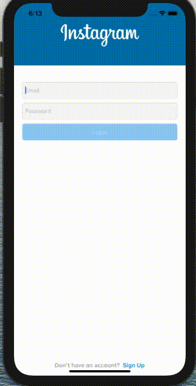

# instagram-clone
instagram-like app integrated with firebase 

## Screenshots 

     

# MVVM(Model-View-View-Model)
This repository contains an ios project that demonstrates Instagram-like app integrated with firebase using mvvm desgin pattern without using storyboards. 

## Cocoa Pods libraries

| Library name  | Description   | 
| ------------- |:-------------:| 
|   Firebase/Auth     | provides built-in functionality with cloud integration for signup and login with email and password |
| Firebase/Storage     | cloud storage SDK allows to store and serve user-generated content such as photos and videos     |
| Firebase/Database     | SDK supports cloud hosted database(NoSQL) Data stored as JSON and sync in real time      |

---

# app screens:

* login
* sign-up
